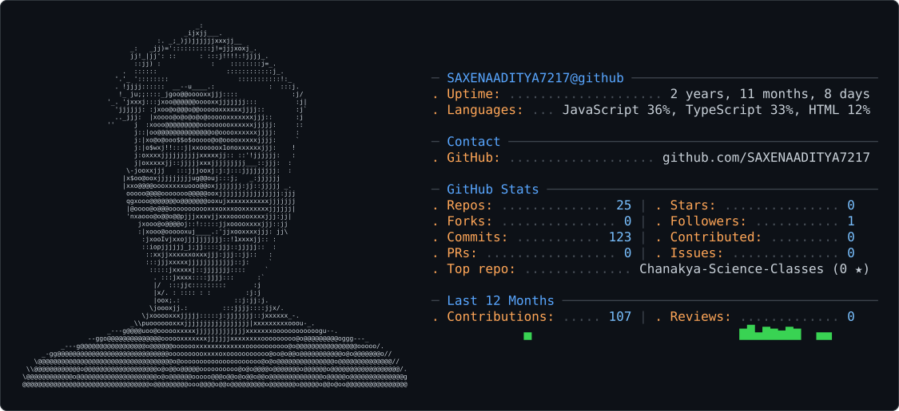

<picture>
  <source media="(prefers-color-scheme: dark)" srcset="dark_mode.svg" />
  <source media="(prefers-color-scheme: light)" srcset="light_mode.svg" />
  
</picture>

# Hi there 👋, I'm Aditya Saxena

🚀 **Java Full-Stack Developer** passionate about building scalable web applications and solving challenging problems through code.

🎓 B.Tech in Computer Science Engineering

💻 **Tech Stack:** Java, Spring Boot, Spring Security, Spring Data JPA, MySQL, React, REST APIs, HTML, CSS, JavaScript

📚 Solved **500+ Data Structures & Algorithms** problems on LeetCode and actively improving problem-solving skills through competitive programming.

🌱 Currently learning advanced backend development, system design, and cloud technologies.

🎯 Open to **Software Engineer**, **Java Backend Developer**, and **Full-Stack Developer** opportunities.

📫 Let's connect and build something amazing!

## 🌐 Socials

## 💻 Tech Stack

## 📊 GitHub Stats

  
   
  
   
  

## 🐍 Contribution Snake

  

> The snake animation is generated automatically from my GitHub contribution graph.

## 📈 Contribution Graph

---

